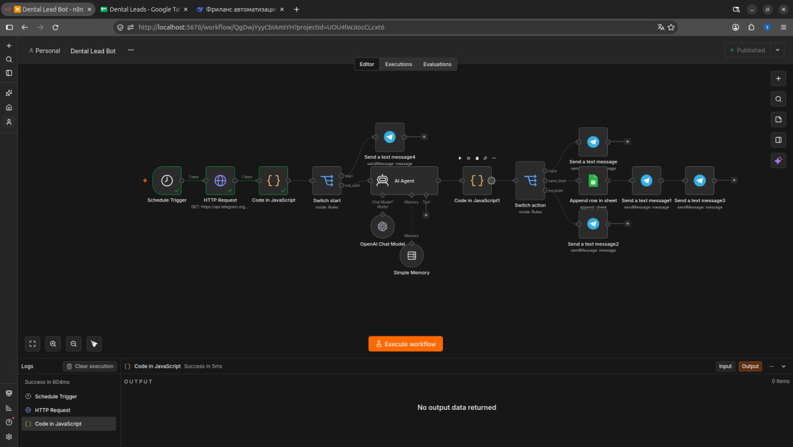
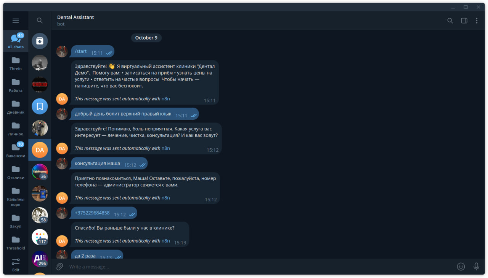
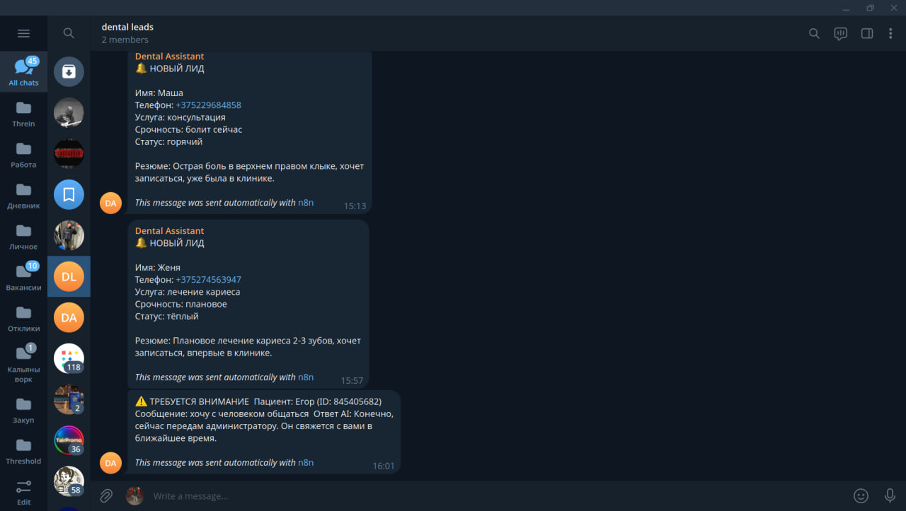
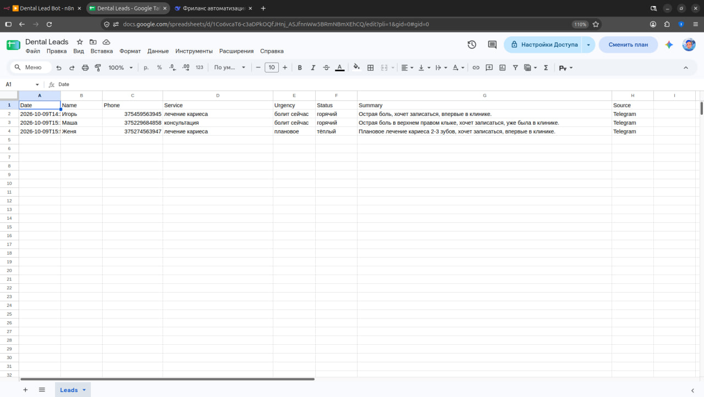

# Dental Lead Bot

Telegram-бот для стоматологических клиник: AI квалифицирует лиды, отвечает на частые вопросы и передаёт горячих пациентов администратору.

## 🎯 Задача

Клиника теряет лиды: пациенты пишут в нерабочее время, администратор не всегда быстро отвечает. Нужен бот, который работает 24/7.

## 🛠️ Решение

AI-агент ведёт диалог, извлекает данные и маршрутизирует по трём действиям:
- `reply` — обычный диалог
- `save_lead` — запись в Google Sheets + уведомление админу
- `escalate` — сразу передать человеку

## 🔧 Стек

- n8n
- Telegram Bot API (polling)
- Vedai API (OpenAI-compatible)
- Google Sheets API
- JavaScript

## 📊 Как работает

1. Пациент пишет боту: `болит зуб`
2. AI ведёт диалог, собирает данные (услуга, срочность, имя, телефон)
3. Квалифицирует лид: горячий / тёплый / холодный
4. Записывает в Google Sheets
5. Отправляет уведомление в группу администраторов
6. Отвечает пациенту

## 📸 Скриншоты

### Workflow в n8n

### Диалог с пациентом

### Уведомление в группе админов

### Google Sheets

## 🚀 Возможности

- Понимает контекст (помнит диалог)
- Не выдумывает цены и мед. советы
- Квалифицирует лиды автоматически
- Мультипациентный (каждый в своей сессии)
- Обрабатывает /start отдельно (приветствие без AI)
- Эскалация на человека при жалобах

## 💰 Для клиники

- Установка под конкретную клинику: 500–800 BYN
- Поддержка: 100–150 BYN/мес
- Окупается на 2–3 лидах в месяц

## 📌 Ограничения демо

- Polling вместо webhook (задержка до 30 сек)
- Для production: VPS + webhook + PostgreSQL + HTTPS
